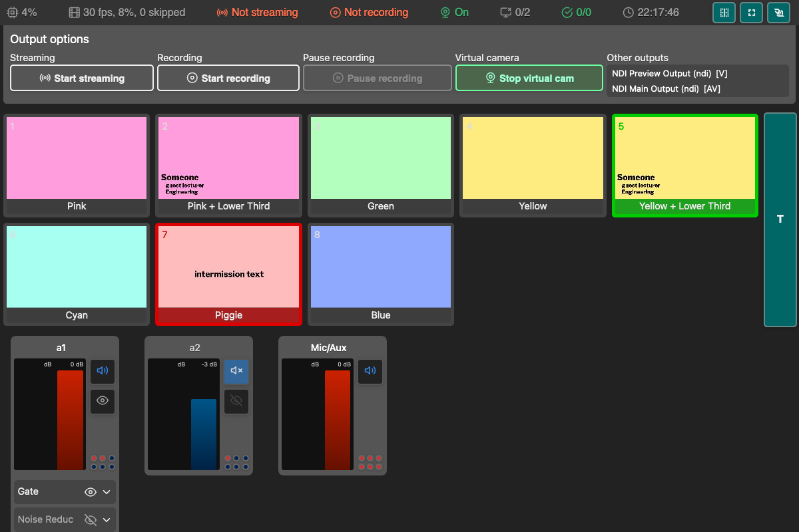

# Web remote for OBS
Web remote UI for controlling [OBS Studio](https://obsproject.com/) via the [obs-websocket plugin](https://github.com/obsproject/obs-websocket)

**[→ Use it online now](https://dvangennip.github.io/web_remote_for_OBS/)**

## Screenshot


## How to use
1. Start [OBS](https://obsproject.com/) (v27.1.3). Make sure [obs-websocket plugin](https://github.com/obsproject/obs-websocket) is installed (v4.9.1).
2. Unless you're using the link above (skip to step 5), download or checkout this repository.
3. Start a webserver in the repo root folder (where `index.html` is located).
    - For example, using python: `python3 -m http.server`
    - You'll now have a webserver on `localhost:8080` (or any other port indicated)
4. Point browser to your webserver url (in the example above, it's [`localhost:8080`](localhost:8080))
5. Control OBS via the webpage.
    - You'll have to enter the obs-websocket connection details on the page before connecting.
    - Code relies on [obs-websocket-js](https://github.com/obs-websocket-community-projects/obs-websocket-js) (included here for convenience)

## Features
- Enable/disable Studio Mode (hotkey: `S`)
- Switch between scenes
    - Transition hotkey: `T` (only when in Studio Mode)
    - Left click to switch to scene or (when in Studio Mode) set Preview scene
    - Use `0-9` to set numbered scene (only available for the first ten scenes)
    - Right click (or `shift + [0-9]`) to immediately set scene as Program (when in Studio Mode)
- Scene previews
    - Updates every 2 seconds for Program and Preview scenes
    - Updates every 10 seconds for inactive scenes
- Control audio sources
    - Mute/unmute
    - Show/hide
    - Volume
    - Filter settings (not all filters are supported)
- Fullscreen toggle hotkey: `F`
- Ability to edit text sources directly

## Notes and known issues
- Some browsers won't allow insecure connections when the page itself is served securely. So the [page on GitHub]((https://dvangennip.github.io/obs_web_remote/)) (which is served via `https`) may not work with a regular local instance of OBS.
    - If so, try using another browser (Firefox or Opera seem to work), enable insecure connections within secure pages (not generally recommended) or download this repo and run it locally.
- Currently not optimised for use on mobile devices.
- Any scenes with `hidden` or `subscene` in their name are ignored and not shown in the scene list.
- Audio list has space dedicated for visual audio volume meters, but that functionality is not yet available in obs-websocket.
- For more, see [Issues](https://github.com/dvangennip/obs_web_remote/issues)

## Adding text source editing
It's possible to add inputs to directly edit text sources in OBS. By adding `input` elements into the `index.html` file, the page can be customised to directly edit specific sources. The following is supported:

- Text inputs
    - These edit text sources in OBS.
    - Make sure the `input` element has an attribute `data-obsr-source` and matching `id` and `name` values that reflect the source name in OBS.
- Select elements
    - Handy to select a preset for multiple text sources in one go.
    - Requires a `data-obsr-selector` attribute to work. Its value should be the source names it feeds into (multiple are split with a `|` character).

See the HTML code below for an example:

````html
<!-- add this into the <ul id="source_list"> tag within index.html -->
<li class="source-item">
    <h4>Lower third</h4>
    <div class="source-inputs">
        <div class="input-wrapper">
            <label for="LT-name">Name</label>
            <input type="text" id="LT-name" name="LT-name" data-obsr-source="LT-name">
        </div>
        <div class="input-wrapper">
            <label for="LT-role">Role</label>
            <input type="text" id="LT-role" name="LT-role" data-obsr-source="LT-role">
        </div>
        <div class="input-wrapper">
            <label for="LT-affiliation">Affiliation</label>
            <input type="text" id="LT-affiliation" name="LT-affiliation" data-obsr-source="LT-affiliation">
        </div>
        <div class="input-wrapper">
            <label for="LT-select">Select from preset list</label>
            <select id="LT-select" name="LT-select" data-obsr-selector="LT-name|LT-role|LT-affiliation">
                <option value="-|-|-">No name chosen</option>
                <option value="Some name|Fake role|Fake unit">Some name</option>
                <option value="Another person|Another role|Affiliation">Another person</option>
            </select>
        </div>
    </div>
</li>
<!-- </ul> -->
````

## License
- [Unlicense](https://unlicense.org/): This is free and unencumbered software released into the public domain.
- [obs-websocket-js](https://github.com/obs-websocket-community-projects/obs-websocket-js) has its own license.
- Icons used are from [lucide.dev](https://lucide.dev/) (see [their license](https://github.com/lucide-icons/lucide/blob/master/LICENSE))
